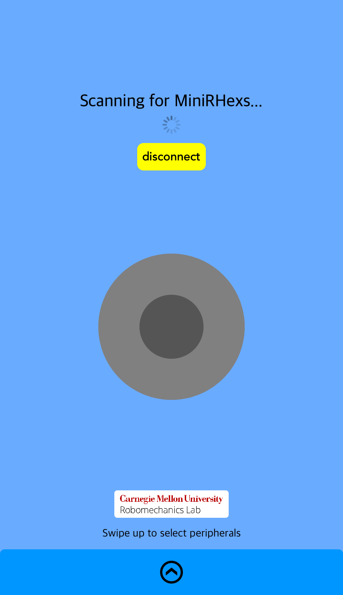

# BTMiniRHex
iOS application for controlling CMU's [Robomechanics](https://www.cmu.edu/me/robomechanicslab/) lab's [MiniRHex](https://github.com/robomechanics/MiniRHex) using Bluetooth.

The MiniRHex needs the  from Robotis in order to connect with an iPhone.

## Screenshot

